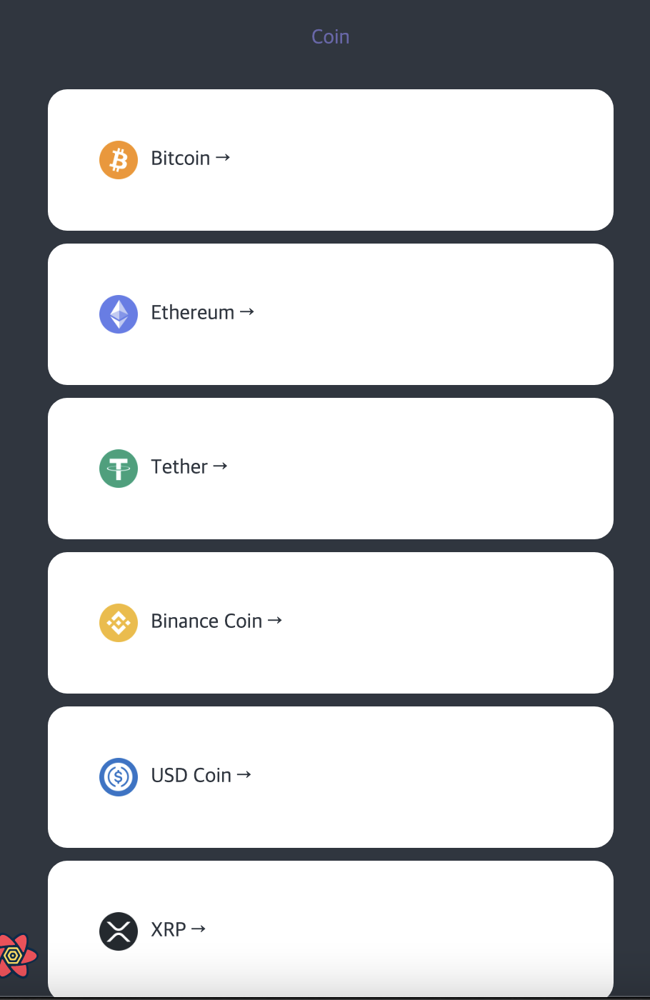
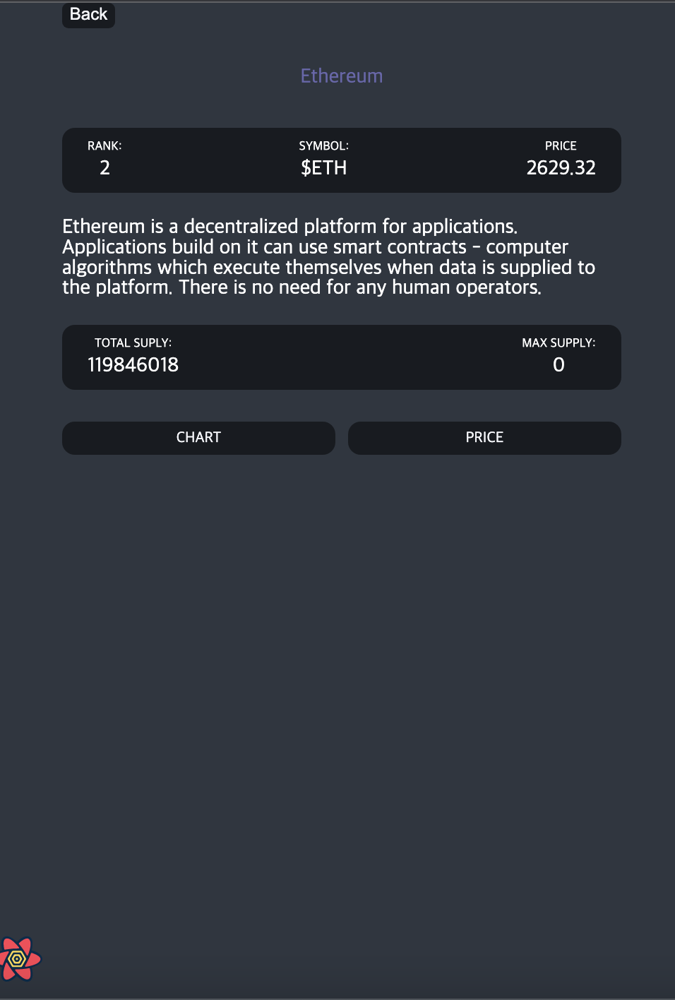
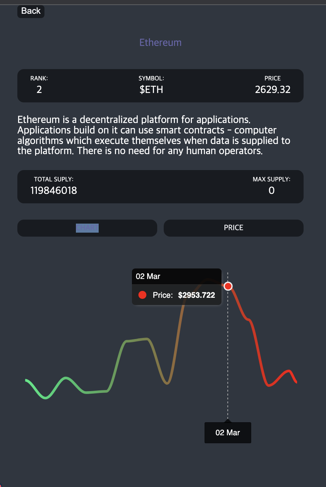
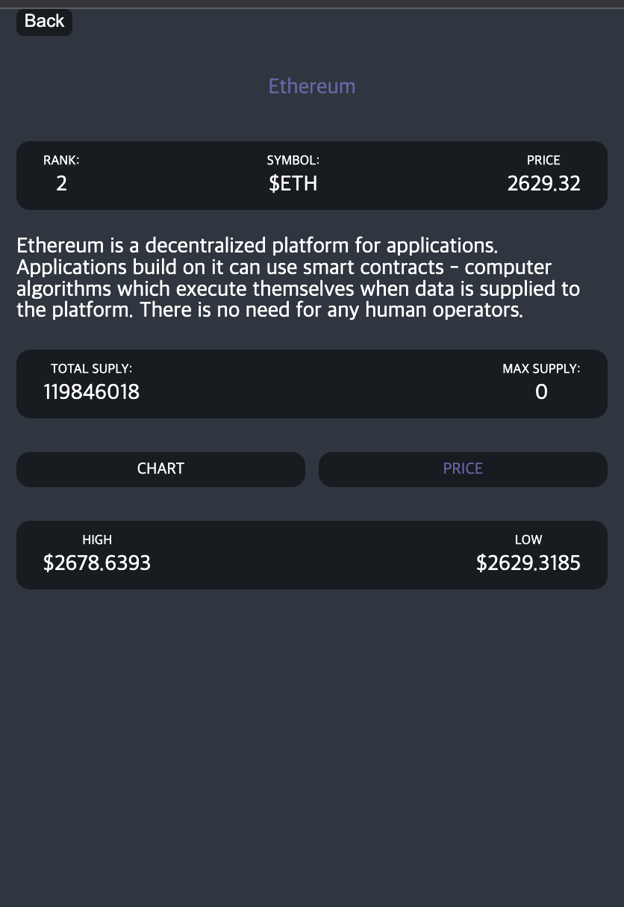

#### coinTracker

코인 데이터 api를 이용한 간단한 코인 웹앱

## 기술 스택 🧑‍💻

1. React
2. Typescript
3. styled-components
4. react Query
5. react-router-dom
6. react-helmet
7. react-apexcharts

### 메인화면(코인 리스트)

### 코인 상세화면

### 코인 상세화면\_차트

### 코인 상세화면\_price

